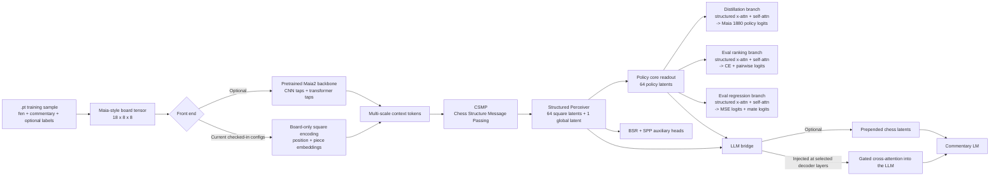

# chess_fusion_training

Training and inference code for the Chess Fusion experiments: a chess-grounded commentary model that combines structured board reasoning, auxiliary chess objectives, and a causal language model.

This repository is the model side of a two-repo split:

- `Synthetic_commentary_generation` handles PGN sampling, prompt construction, synthetic/programmatic commentary generation, recovery, normalization, and `.pt` dataset export.
- `chess_fusion_training` handles model code, configs, training loops, checkpoints, and inference.

## What The Model Is Trying To Do

The core idea is to avoid treating a chess position as a single pooled embedding. Instead, the model keeps square-level structure alive for as long as possible:

- represent the board as 64 square tokens plus side-to-move context
- inject explicit chess topology before the LLM ever sees the position
- compress the board into structured latents rather than a single vector
- train those latents with chess-native objectives before or alongside commentary generation
- fuse chess state into selected LLM layers instead of relying only on prompt text

## Architecture At A Glance



## Component Breakdown

### 1. Input Representation

Every position starts as a Maia-compatible board tensor.

- Input board shape: `18 x 8 x 8`
- Channels: white pieces, black pieces, side to move, castling rights, en passant
- Source of truth for this encoding: [`src/training/maia_model.py`](src/training/maia_model.py)

The code also corrects perspective when needed. Black-to-move positions can be un-mirrored into absolute board coordinates so square `a1` always means the same thing during structured reasoning and auxiliary supervision.

### 2. Front End: Maia Backbone Or Board-Only Path

The repository supports two ways to build board features:

- Maia-backed path: tap intermediate Maia CNN blocks and optional Maia transformer tokens.
- Board-only path: skip the pretrained Maia backbone and build square tokens directly from learned positional and piece embeddings.

The current checked-in configs use the board-only path:

- `model.chess_fusion.use_cnn: false`
- `model.chess_fusion.use_chess_structure_mp: true`

That means the published architecture currently leans on explicit board structure more than on a pretrained visual-style backbone.

### 3. CSMP: Chess Structure Message Passing

`ChessStructureMP` is the main chess-specific inductive bias in this codebase.

It runs sparse multi-head attention over 64 square tokens, where attention heads are assigned to chess relations:

- same file
- same rank
- same diagonal
- same anti-diagonal
- knight connectivity
- king-neighborhood connectivity
- dynamic sliding rays based on occupancy
- dynamic attack relations based on piece type and blockers

Extra heads, when present, can be global.

This gives the model a board graph that already knows something about legal geometry before the generic Perceiver layers start compressing information.

#### CSMP Relative Positional Modes

The baseline CSMP path is still masks-only:

- the chess masks decide which square pairs may communicate
- among allowed edges, attention routing is purely content-driven

Two optional relative-position modes now live inside `ChessStructureAttention`:

- `csmp_relative_mode: none`
  - current baseline behavior
  - uses SDPA with hard chess masks only

- `csmp_relative_mode: score_bias`
  - adds a learned score bias indexed by `(head, delta_rank, delta_file)`
  - equation: `score_ij = q_i · k_j / sqrt(d) + b_h[delta_rank(i,j), delta_file(i,j)]`
  - this changes routing only; values stay unchanged
  - stays on the SDPA path, so it is the cheaper relative-position option

- `csmp_relative_mode: edge_modulation`
  - builds a learned edge embedding from static geometry plus head identity
  - v1 uses only signed square offsets and head id in the edge embedding; dynamic ray/attack signals remain hard masks
  - equations:
    - `k_rel_ij = k_j + W_k(r_ij)`
    - `gamma_ij, beta_ij = W_v(r_ij)`
    - `v_rel_ij = (1 + 0.1 * tanh(gamma_ij)) * v_j + beta_ij`
    - `score_ij = q_i · k_rel_ij / sqrt(d)`
  - this changes both routing and message semantics
  - uses a custom attention path instead of SDPA, so it is more expressive but more expensive

Example config snippets:

```yaml
# Routing-only relative logits
csmp_relative_mode: score_bias
csmp_relative_edge_dim: 16  # ignored in score_bias mode
```

```yaml
# Pair-conditioned key/value modulation
csmp_relative_mode: edge_modulation
csmp_relative_edge_dim: 16
```

Source files:

- [`src/training/chess_structure_mp.py`](src/training/chess_structure_mp.py)
- [`src/training/chess_fusion_model.py`](src/training/chess_fusion_model.py)

### 4. Structured Perceiver Latents

`SquareLatentEncoder` is the latent bottleneck for the whole system.

In the current structured-latent regime:

- there are `65` latents total
- `64` latents correspond to board squares
- `1` latent is global

Each Perceiver block runs:

1. latent self-attention
2. cross-attention from latents to the multi-scale chess context
3. an FFN update

The structured mode can also enforce `strict_own_square` masking, where each square latent is encouraged to read mainly its own square token plus the side-to-move token, while the global latent aggregates across the full board.

This is the main reason the model stays interpretable at a high level: it preserves square identity rather than immediately collapsing everything into a single vector.

On top of those Perceiver latents, the current structured-policy path builds a second square-aligned representation: `64` policy latents returned by `_structured_policy_square_readout()`. Those policy latents are the shared, LLM-facing policy core in the current implementation.

### 5. Chess-Native Heads And Objectives

The latent space is trained with several chess objectives:

- Shared policy core:
  - `_structured_policy_square_readout()` produces `64` policy latents from the Perceiver output.
  - those `policy_latents` are the square-level representation passed into the LLM bridge and prepend-latent modules
  - they are also the common source for the specialized prediction branches below

- Branch 1: Maia policy distillation
  - a dedicated `StructuredSquareBranchLayer` applies one more structured cross-attention update, full self-attention across all `64` squares, and an FFN
  - the refined square latents are projected into separate `from` and `to` spaces
  - each move in Maia's `1880`-move vocabulary is scored by a dot product between its selected `from` square embedding and `to` square embedding, plus an optional move bias
  - supervision is usually cached `maia_policy` from the dataset in the checked-in configs (`use_precomputed_policy: true`), with a live Maia teacher kept as a fallback path

- Branch 2: move-eval ranking head
  - a second `StructuredSquareBranchLayer` specializes the shared policy core for ranking-style supervision
  - its move logits are trained with soft CE over supervised candidate moves and with pairwise ranking loss over top-k target moves
  - this branch is the current meaning of `move_eval_logits`

- Branch 3: move-eval regression head
  - a third `StructuredSquareBranchLayer` specializes the shared policy core for centipawn regression
  - its move logits are trained with MSE against clipped, normalized centipawn targets
  - these logits are exposed separately as `move_eval_mse_logits`

- Mate head
  - the mate classifier now rides on top of the regression-specialized branch rather than the ranking branch
  - it uses its own `from` and `to` projections, but shares the regression branch's square latents
  - targets come from the move-eval supervision: large-magnitude engine scores are treated as mate labels

- BSR: Board State Reconstruction
  - predicts one of `13` classes per square: white piece type, black piece type, or empty
  - targets are derived directly from the absolute board tensor, not from a teacher model

- SPP: Square Property Prediction
  - predicts `10` numeric channels per square
  - channels include white/black attack counts plus ray-distance features over the `8` compass directions
  - targets are also derived directly from the board tensor at training time

- Deprecated pooled eval head
  - the old `aux_repr -> eval bucket classifier` path still exists in code for backward compatibility
  - the checked-in configs set `aux_eval_weight: 0.0`, so it is normally inactive

These losses let the adapter learn useful chess structure even when the commentary LM is frozen or disabled.

### 6. LLM Fusion

When `model.mode` is `chess_fusion`, the adapter is injected into a HuggingFace causal LM.

The flow is:

- selected decoder layers are wrapped with `FusionDecoderLayer`
- each wrapper can add learned pseudotoken memory for that layer
- chess context is then fused through gated cross-attention
- the LLM can also receive prepended chess latents as extra prefix embeddings

The code now supports two decoder-fusion modes:

- `recurrent_query_attn`: legacy recurrent text queries plus direct source blending from Perceiver / policy / CSMP sources
- `structured_square_mixer`: a square-structured mixer where each token learns a soft weighting over `64 x 3` aligned slots (`CSMP_i`, `Perceiver_i`, `Policy_i`) conditioned on its text latent plus the Perceiver global latent, with a separate small global branch for the Perceiver global latent and side token

The active checked-in LM configs use `structured_square_mixer`, so decoder fusion stays aligned with the model's square-centric latent regime instead of letting each token query the whole chess context freely.

The important architectural detail is that the LLM does not read the branch-specific prediction heads directly. It reads the shared `policy_latents` core plus the generic Perceiver and CSMP sources. That keeps one square-aligned policy representation central to both chess supervision and text fusion, while the three prediction branches specialize only the final objective readouts.

Supported decoder layouts include common HuggingFace stacks such as:

- LLaMA-family models
- GPT-NeoX-family models
- GPT-2-style models

The default checked-in LM target is TinyLlama with LoRA.

Implementation note: `SharedLayerReadout` remains in the file for the legacy recurrent-query path. The structured square mixer bypasses it and reads the aligned square sources directly.

For the precise forward equations and the exact definitions of the square-marginal sparsity and square-diversity auxiliary losses, see [`docs/structured_square_mixer_math.md`](docs/structured_square_mixer_math.md).

## Current Checked-In Training Regimes

Three configs currently capture the intended workflow:

### `configs/simpler_arch_policy`

Adapter-first pretraining focused on chess understanding.

- CSMP enabled
- structured latents enabled
- shared policy core plus the three branch-specific prediction heads enabled
- policy / move-eval / BSR / SPP objectives enabled
- LM objective disabled in the checked-in config

### `configs/simpler_arch.yaml`

Smaller LM-on configuration using the same architecture family.

- board-only structured chess encoder
- TinyLlama base model
- LoRA enabled
- shared policy core passed into LLM fusion
- `structured_square_mixer` decoder fusion enabled
- prepended chess latents and decoder-layer fusion both enabled

### `configs/pretrain_lm.yaml`

Higher-capacity LM-on configuration with the same structural design.

- same shared policy-core / three-branch objective layout
- TinyLlama base model
- LoRA enabled
- `structured_square_mixer` decoder fusion into selected decoder layers
- optional prepended chess latents enabled in the checked-in config
- prepended latent prefix can optionally skip consuming LLM positional encoding

There is also a dedicated `PolicyOnlyModel` class in [`src/training/train.py`](src/training/train.py) for pure adapter pretraining without loading an LLM.

## Key Files

- [`src/training/chess_fusion_model.py`](src/training/chess_fusion_model.py): top-level fusion architecture, Perceiver, auxiliary heads, and LLM injection logic
- [`src/training/chess_structure_mp.py`](src/training/chess_structure_mp.py): chess-topology message passing
- [`src/training/maia_model.py`](src/training/maia_model.py): Maia integration and board tensor construction
- [`src/training/train.py`](src/training/train.py): model assembly, training loop, LoRA setup, checkpointing
- [`docs/structured_square_mixer_math.md`](docs/structured_square_mixer_math.md): exact math for structured decoder fusion and its routing regularizers
- [`configs/simpler_arch_policy`](configs/simpler_arch_policy): adapter-oriented policy-only config
- [`configs/simpler_arch.yaml`](configs/simpler_arch.yaml): smaller LM-on config
- [`configs/pretrain_lm.yaml`](configs/pretrain_lm.yaml): commentary training config

## Training Data Contract

Training consumes directories of `.pt` samples exported from `Synthetic_commentary_generation`.

Required fields:

- `fen`
- `commentary`

Optional fields consumed when present:

- `pgn_moves`
- `last_move`
- `maia_policy`
- `stockfish_eval_cp`
- `move_evals`
- `stockfish_best_moves`
- `sample_id`
- `task`
- `source`
- `metadata`

The loader is intentionally permissive so the data-export side can evolve metadata without breaking training.

Source of the normalization logic:

- [`src/training/sample_contract.py`](src/training/sample_contract.py)

## Running Training

From the repository root:

```bash
python src/training/train.py --config configs/pretrain_lm.yaml
```

Or for adapter-focused pretraining:

```bash
python src/training/train.py --config configs/simpler_arch_policy
```

## Why This Repo Is Interesting

From a modeling perspective, this project sits in the middle ground between a pure chess engine and a pure language model:

- it keeps explicit board structure instead of relying on prompt-only conditioning
- it uses chess-native auxiliary targets, not just next-token loss
- it supports staged training, where chess understanding can be learned before fluent commentary
- it experiments with multiple fusion strategies while staying compatible with standard HuggingFace LMs

That combination is the main architectural idea behind Chess Fusion.
