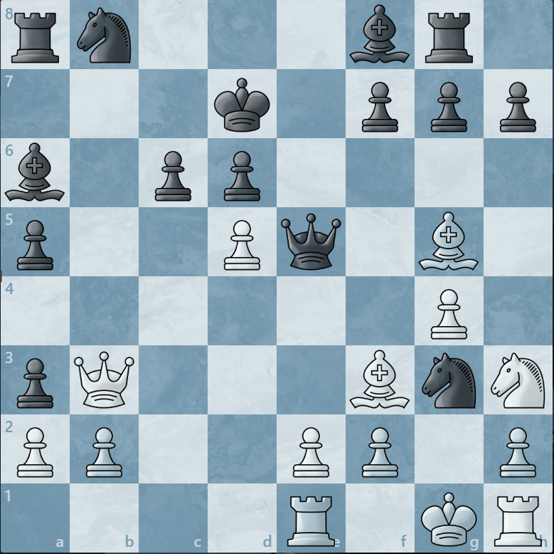

# ChessFormer

This is an experimentation-focused project that aims to build a language model with native chess multimodal understanding. Rather than forcing a language model to reason about chess as text tokens, this project designs a chess-specific deep fusion architecture that enables the LLM to selectively inject structured chess information deep within it's reasoning layers to focus on specific aspects of the position.

## Main Project Details

- **Native chess architecture**: a specialized chess-encoder processes the position to produce 64 square latents. It implements chess relational attention mechanisms among other structured encoding mechanisms to preserve square-centric identity, supporting strong representations and interpretability probing.

- **Auxiliary objectives**: auxiliary chess objectives (maia policy distillation, move evaluation, board reconstruction) use square-level prediction heads, enabling structured representation learning to support the primary task of generating commentary.

- **Decoder-side fusion**: chess latents are injected into the LLM's decoder layers via dynamically gated cross-attention. Based on the current text latents, the model learns the kinds and amounts of chess information to inject. A decoding inspector provides visualizations of the model's attention patterns to the chess latents while decoding.

- **Commentary regimes**: Chess commentary is supplied by [Synthetic Commentary Generation](https://github.com/TODO/synthetic_commentary_generation) and potentially[Chessvisor](https://github.com/TODO/chessvisor). Using LLM augmented tools, we can curate multiple viable training curricula, from low-entropy factoids to chatbot-style Q&A/coaching.

## Current State

Current efforts have aimed to train the model on low-entropy factoid-based commentary. This achieves solid state-grounded chess multimodality, setting the stage for more abstract, humanlike commentary styles. Given a board state, it generates commentary that demonstrates high accuracy on state-driven observations with few errors:

> Black's knight on g3 threatens White's rook on h1. Black's pawn on a3 is attacking White's pawn on b2. White's pawn on b2 threatens Black's pawn on a3. White's queen on b3 is attacking Black's knight on b8 and Black's pawn on a3. White's pawn on f2 attacks Black's knight on g3. White's pawn on h2 is attacking Black's knight on g3. Black's knight on g3 supports Black's bishop on a6. White's pawn on d5 is attacking Black's pawn on c6. Black has a semi-open b-file. White's king on g1 guards White's rook on h1, White's pawn on f2, and White's pawn on h2. White's pawn on a2 supports White's queen on b3. Black's pawn on c6 attacks White's pawn on d5. White's king is castled kingside. White's knight on h3 is on the rim. Black's bishop on f8 guards Black's pawn on d6 and Black's pawn on g7. White's king has a weakened pawn shield. Black's queen on e5 threatens White's bishop on g5, White's pawn on e2, White's pawn on b2, and White's pawn on d5. White's pawn on e2 defends White's bishop on f3. Black has a semi-open e-file. White's knight on h3 protects White's king on g1, White's pawn on f2, and White's bishop on g5. Black's bishop on a6 is attacking White's pawn on e2. White's rook on h1 guards White's king on g1 and White's pawn on h2. Black's queen on e5 guards Black's knight on g3, Black's pawn on d6, and Black's pawn on g7. Black's king remains in the center on d7. 





## Architecture Overview

```
Board Position (FEN)
    |
    v
Board Encoder (64 square tokens + side-to-move)
    |
    v
Chess Structure Message Passing (CSMP)
  - 8 chess relation types (files, ranks, diagonals, knight moves, rays, attacks...)
  - sparse multi-head attention with chess topology masks
    |
    v
Structured Perceiver (64 square latents + 1 global)
  - strict own-square masking preserves square identity
    |
    +---> Auxiliary Heads (policy distillation, move-eval, board state reconstruction)
    |
    v
LLM Decoder Fusion
  - gated cross-attention at selected decoder layers
  - structured square mixer: each text token routes to 64x4 aligned slots
  - optional prepended chess latents as prefix embeddings
    |
    v
Commentary Output (TinyLlama 1.1B + LoRA)
```

## Training Data

Training data is generated by the companion [Synthetic Commentary Generation](https://github.com/TODO/synthetic_commentary_generation) repository, which uses methods such as commentary templates, engine analysis, motif detection, importance scoring, and LLM-based commentary synthesis. Exported `.pt` samples are consumed directly by the training loop here.

## Documentation

- [Architecture Deep Dive](docs/architecture.md) — detailed component breakdown, CSMP modes, Perceiver regime, fusion strategies
- [Training Guide](docs/training.md) — config walkthrough, training regimes, how to run
- [Data Pipeline](docs/data_pipeline.md) — sample contract, data flow from PGN to training
- [Structured Cross-Attn Math](docs/structured_square_mixer_math.md) - exact forward equations and structured square-attention regularizers
- [Structured Decode Inspector](docs/decoding_inspector.md) - browser GUI for token-by-token commentary decoding and `64 x N_src` square-attention visualization

## Quick Start

```bash
pip install -r src/requirements.txt

# Full commentary training (LLM + adapter)
python src/training/train.py --config configs/chess_fusion.yaml

# Adapter-only pretraining (chess objectives only, no LLM)
# Set model.enable_lm: false in the config
python src/training/train.py --config configs/chess_fusion.yaml

# Inspect a saved structured_cross_attn checkpoint in the browser
python src/inference/decoding_inspector.py --checkpoint <checkpoint_dir>
```

## Key Files

| File | Description |
|------|-------------|
| `src/training/chess_fusion_model.py` | Core architecture: encoder, Perceiver, auxiliary heads, LLM fusion |
| `src/training/chess_structure_mp.py` | Chess topology message passing (CSMP) |
| `src/training/train.py` | Training loop, model assembly, checkpointing |
| `src/training/sample_contract.py` | Training data loading and normalization |
| `configs/chess_fusion.yaml` | Annotated training configuration |
