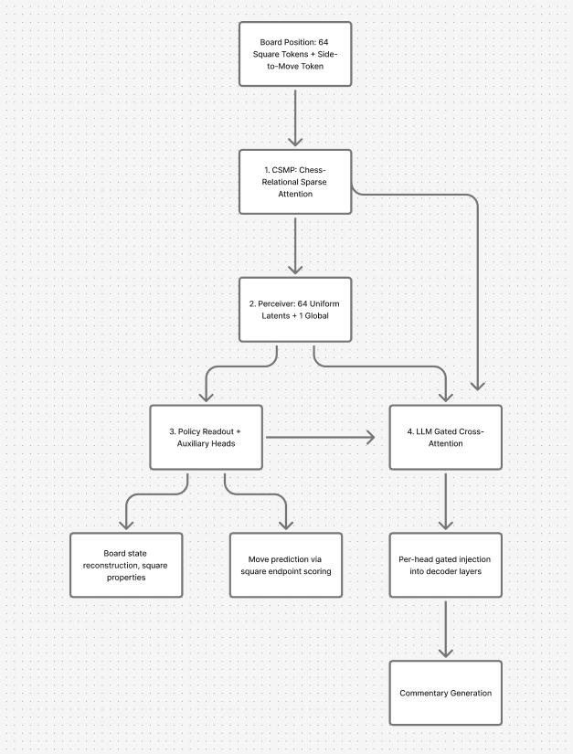
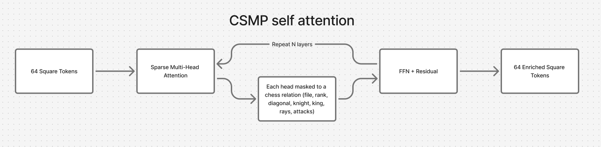
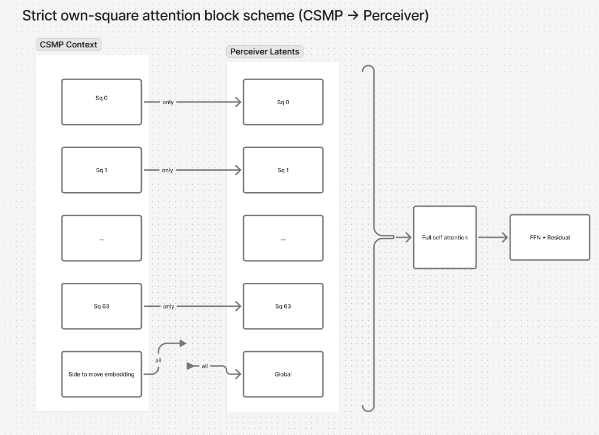
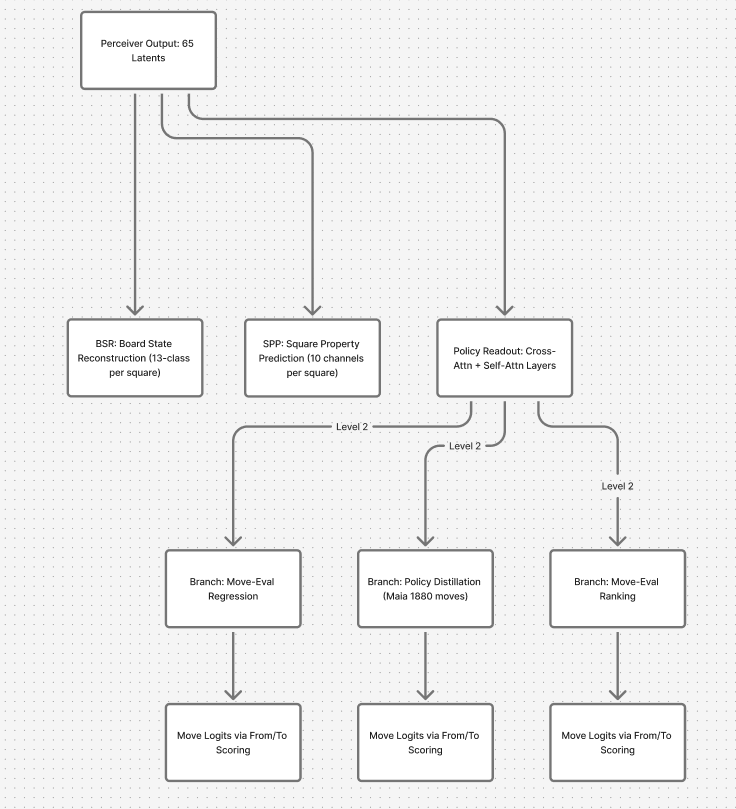
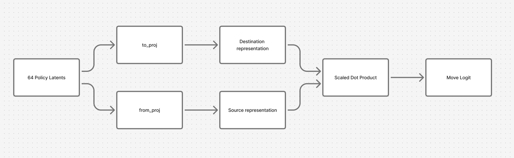
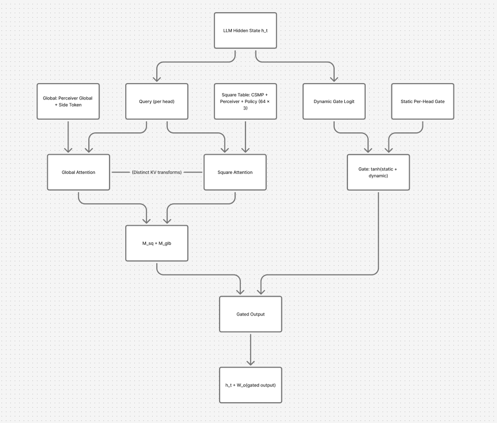

# Architecture

## Design Philosophy
Language models are notouriously bad at chess. Evidently, causal langauge modeling does not naturally encode the intricate geometric relationships that are fundamental to chess. To adapt LLMs for chess, they need a specialized adapter. Similar to CNN encoders that enable LLMs to process visual data, we need a chess position encoder to encode the board state in a way that is meaningful to the model.

The best-performing neural chess engines traditionally use dense 64×64 attention or convolutional stems, learning chess structure implicitly from data. While these architectures are effective at scale, they function as black boxes which don't provide mechanisms to enforce strong square-level intermediate representations that align with meaningful chess concepts. They also require the model to discover well-known geometric relationships from scratch.

This project enforces chess structure directly through two strategies:

1. **Sparse relation-specific attention masks** dedicate early attention layers to route information along chess-meaningful paths (files, ranks, diagonals, knight hops, attack rays), so the model operates on the board's actual geometry rather than learning to approximate it.
2. **Square-aligned information bottlenecks** ensure that each latent representation corresponds to a specific board square, creating representations where each square encodes information directly relevant to it.

Together, these produce an architecture with key properties:

- **Chess-native inductive bias.** The model doesn't learn chess topology from scratch—it's encoded structurally. This improves optimization efficiency, particularly in low-compute regimes.
- **Mechanistic interpretability.** Square-aligned latents allow direct inspection of what squares the model focuses on and how information routes through the architecture.
- **Transferability.** Strong representation learning enables easier adaptation to commentary generation in LLM fusion. 

## Pipeline

[View diagram: Architecture Pipeline Overview](https://www.figma.com/online-whiteboard/create-diagram/4a1e1fdb-385d-447b-a1b6-c518fff363fe?utm_source=other&utm_content=edit_in_figjam&oai_id=&request_id=6a7bac6e-3c19-4634-855f-b2c4e44b835f)

## 1. Chess Square Message Passing (CSMP)

Raw positions enter as **64 square embeddings**, each encoding piece type and position. CSMP processes only these 64 square tokens through its relational attention heads. A side-to-move token is added to the output context after CSMP processing.

`ChessStructureMP` runs multi-layer sparse attention where **each attention head operates over a distinct chess relation**, acting as a dedicated information channel for that geometric relationship:

[View diagram: CSMP Chess Relational Attention](https://www.figma.com/online-whiteboard/create-diagram/e49af47d-679c-47c2-8a29-49034970b450?utm_source=other&utm_content=edit_in_figjam&oai_id=&request_id=fb00454a-87e2-48d1-a1a2-45497355a0e2)

| Head | Relation | What it connects |
|------|----------|-----------------|
| 0 | File | Squares sharing a column |
| 1 | Rank | Squares sharing a row |
| 2 | Diagonal | NW–SE aligned squares |
| 3 | Anti-diagonal | NE–SW aligned squares |
| 4 | Knight | L-shaped hops (up to 8 targets + self) |
| 5 | King | 8-adjacent neighborhood + self |
| 6 | Sliding rays | Unobstructed paths (dynamic per position) |
| 7 | Attacks | Piece-specific attack patterns (dynamic per position) |

Heads 0–5 use static masks derived from board geometry. Heads 6–7 compute masks dynamically based on piece placement and occupancy, capturing the position-dependent nature of sliding-piece attacks and ray connectivity.

### Relative Position Modes

CSMP supports three modes for optional relative position encoding that influence how square pairs interact within each relation:

| Mode | Behavior |
|------|----------|
| `none` | Masks-only baseline; routing is purely content-driven |
| `score_bias` | Adds learned bias indexed by `(head, delta_rank, delta_file)`; changes routing, not values |
| `edge_modulation` | Learned edge embeddings modulate both keys and values; more expressive but more expensive |

Source: `src/training/chess_structure_mp.py`

## 2. Structured Perceiver Latents

`SquareLatentEncoder` maintains **64 learned square latents plus 1 learned global latent** that read from the CSMP context via cross-attention.

Each perceiver block applies three operations in sequence:

1. **Full self-attention** among all 65 latents. Every square can exchange information with every other square and the global latent, enabling board-wide reasoning.
2. **Strict own-square cross-attention** to the assembled context (CSMP square outputs + side-to-move token). Each square latent attends *only* to its corresponding CSMP square token (plus optionally the side-to-move token, which was added after CSMP processing). The global latent attends to all context tokens.
3. **FFN** per-latent feedforward update.

[View diagram: Strict Own-Square Cross-Attention](https://www.figma.com/online-whiteboard/create-diagram/7ed87d6c-9cf5-4bc8-aa1d-b8516256b035?utm_source=other&utm_content=edit_in_figjam&oai_id=&request_id=d97876e6-8447-444d-9ab4-e59f35c25682)

The strict own-square masking is the core mechanism that enforces square-level representations: each latent can only absorb local information through cross-attention, while broader context must route through self-attention with other latents. This creates an information bottleneck that preserves sharp square identity throughout the pipeline. The same masking pattern is reused in the policy readout's cross-attention, maintaining consistent square alignment from encoding through prediction.

All 64 square latents are initialized from a single shared base vector, expanded identically across positions. 

Source: `src/training/chess_fusion_model.py`

## 3. Policy & Auxiliary Readout

### Branching Architecture

The perceiver's 65 latents feed two levels of task-specific branching:

[View diagram: Policy & Auxiliary Readout Branching](https://www.figma.com/online-whiteboard/create-diagram/3ddaa27b-35d9-4dfe-b16a-93ab86eb61da?utm_source=other&utm_content=edit_in_figjam&oai_id=&request_id=f02bf49a-a8bc-45ad-9270-bf0b97e64be9)

**Level 1 — From Perceiver:**
- 64 square latents → **Policy Readout** (`_structured_policy_square_readout`): additional cross-attention and self-attention layers refine square representations for move prediction
- 64 square latents → **BSR** (Board State Reconstruction): 13-class per-square piece identity
- 64 square latents → **SPP** (Square Property Prediction): 10 numeric channels per square (attack counts, ray distances)

**Level 2 — From Policy Readout:**
Each move-prediction task gets its own branch layer (`StructuredSquareBranchLayer`) with dedicated cross-attention and self-attention:
- **Policy distillation**: Maia move probabilities (1880-move vocabulary)
- **Move-eval ranking**: Soft CE + pairwise ranking
- **Move-eval regression**: Centipawn + mate prediction

### Move Prediction via Square Endpoint Scoring

Rather than maintaining a separate move-token vocabulary, all move heads score candidates by pairing **source and destination square representations**:

[View diagram: Move Prediction via Square Endpoint Scoring](https://www.figma.com/online-whiteboard/create-diagram/4e05093a-16ba-4f62-90d1-16a796c6d4db?utm_source=other&utm_content=edit_in_figjam&oai_id=&request_id=e3b8fcd2-83dc-4df6-af7a-ef7094ce8570)

1. The 64 policy latents are projected into separate **from-space** and **to-space** via learned projections (`from_proj`, `to_proj`).
2. For each candidate move in the 1880-move Maia vocabulary, the model gathers the from-square and to-square representations.
3. The move logit is the **scaled dot product** of the two endpoints:

$$
\text{logit}(m) = \frac{\mathbf{f}_{s(m)} \cdot \mathbf{t}_{d(m)}}{\sqrt{d}} + b_m
$$

where $s(m)$ and $d(m)$ are the source and destination squares, and $b_m$ is an optional per-move bias.

Each of these auxiliary tasks are grounded in square-level predictions. Supervision flows back into square-aligned latents incentivizing structured representations over highly entangled ones.

Source: `src/training/chess_fusion_model.py`

## 4. LLM Gated Cross-Attention

Selected decoder layers are wrapped with `FusionDecoderLayer`, injecting chess context via **per-head gated structured cross-attention** with two parallel branches.

[View diagram: LLM Gated Cross-Attention Fusion](https://www.figma.com/online-whiteboard/create-diagram/da4e5d77-4943-48a1-9cb6-ee24c9ff7f49?utm_source=other&utm_content=edit_in_figjam&oai_id=&request_id=35efa308-7d44-4c14-8efb-a5bb680652c4)

### Square Branch

A structured table of **64 × Nsrc square-aligned slots** is assembled from multiple sources, each projected through a dedicated MLP:

| Source | Content |
|--------|---------|
| CSMP | Low-level relational features per square |
| Perceiver | Compressed square latents |
| Policy | Task-refined square representations |
| Engineered (optional) | 205-dim grounded features: square identity, piece occupancy, attack/defense bitmasks |

Each LLM token forms a query from its hidden state, attends over the full 64 × Nsrc square table via per-head attention, and produces a square message.

### Global Branch

A separate 2-token branch provides position-level context:
- Perceiver global latent
- Side-to-move token

### Token-Conditioned Gating

The effective injection gate combines a static learned per-head component with a dynamic token-conditioned component:

$$
g_{\text{eff}}[b,t,h] = \tanh\!\bigl(g_h^{\text{static}} + \ell_{b,t,h}\bigr)
$$

where $\ell_{b,t,h}$ is produced from the same normalized hidden state that forms the attention query. This couples "which chess features matter" with "how much chess to inject" within the same decoder context. The output is:

$$
h'_t = h_t + g_{\text{eff}} \cdot W_o\!\bigl[\text{M}_{\text{sq}} + \text{M}_{\text{glb}}\bigr]
$$

followed by a gated FFN residual.

The LLM reads the shared policy latents and CSMP/Perceiver sources directly—not the branch-specific prediction heads. This keeps the same square-aligned representations central to both chess supervision and text generation.

### Engineered Feature Ablation

An ablation mode (`engineered_only_xattn_ablation`) bypasses the learned CSMP/Perceiver pipeline entirely, feeding only the 205-dim engineered features into structured cross-attention. This isolates whether the cross-attention mechanism alone can route grounded square-local features into the LLM, independent of the learned adapter.

Source: `src/training/chess_fusion_model.py`

## Optional Regularization

Three structured regularizers keep the cross-attention path well-behaved:

- **Sparse square-attention**: Encourages focused attention over squares (gate-weighted entropy)
- **Square diversity**: Prevents collapse to a few favored squares (minimum usage entropy threshold)
- **Gate usage**: Keeps the structured path active when useful (minimum gate activation threshold)

Layer pseudotokens add per-layer learned KV memory, but are not board-conditioned. Their intended use is regularization/adaptation while the LLM stays frozen, letting those tokens absorb commentary-style priors so structured cross-attention can stay focused on chess content.

For exact forward equations and regularizer definitions, see [structured_square_mixer_math.md](structured_square_mixer_math.md).

## Supported LLM Backends

The fusion layer supports common HuggingFace decoder stacks:

- LLaMA-family (default: TinyLlama 1.1B with LoRA)
- GPT-NeoX-family
- GPT-2-style
