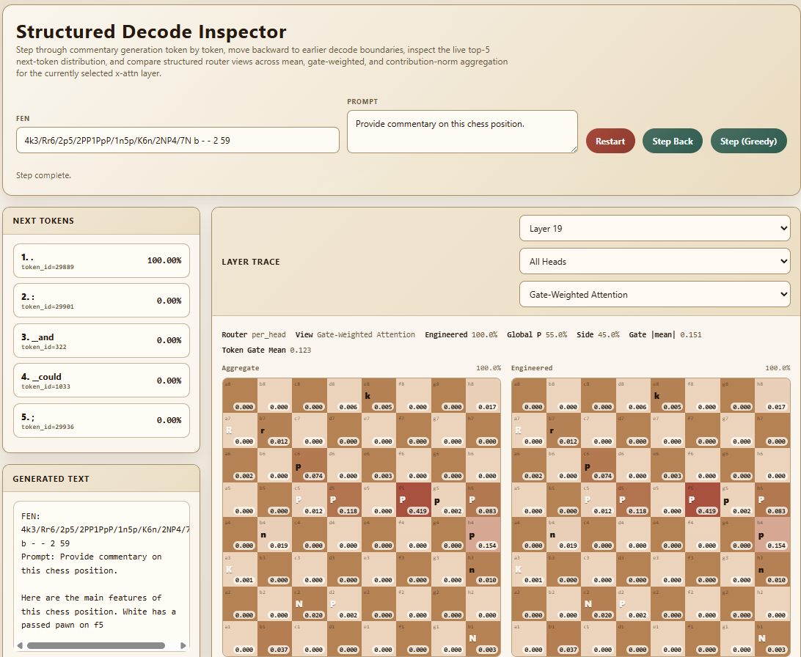

# Structured Decode Inspector

The structured decode inspector is a local browser GUI for stepping through
commentary generation one token at a time while visualizing how a
`chess_fusion` checkpoint attends into board-aligned chess state.

This tool is implemented in
`src/inference/decoding_inspector.py`.

## When To Use It

Use the inspector when you want to answer questions like:

- which token the model currently wants to emit next
- how peaked or uncertain the next-token distribution is
- which squares a selected cross-attention layer used to produce the last token
- whether a layer is reading more from CSMP, Perceiver, Policy, or optional Engineered features
- whether different x-attn heads are specializing on different squares or sources
- how large the token-conditioned effective chess gates are for the current token

This is primarily an interpretability and debugging tool for
`xattn_mode: structured_cross_attn` (legacy alias: `structured_square_mixer`).

## Supported Checkpoints

The GUI currently supports only checkpoints that satisfy both conditions:

- `model.mode: chess_fusion`
- `model.chess_fusion.xattn_mode: structured_cross_attn` (or the deprecated alias `structured_square_mixer`)

It fails fast on other checkpoint types because the square heatmaps rely on the
structured square-attention layout.

## Launching The GUI

From the `chess_fusion_training` directory:

```bash
python src/inference/decoding_inspector.py --checkpoint <checkpoint_dir>
```

Optional flags:

- `--port 8765`
- `--load-lora` or `--no-load-lora`
- `--use-merged-base`
- `--prior-checkpoints <ckpt1> <ckpt2> ...`

On startup the script prints a local URL like:

```text
http://127.0.0.1:8765
```

Open that in a browser.

## What The GUI Shows

### FEN And Prompt Controls

- `FEN` sets the chess position to inspect
- `Prompt` sets the user text prompt before generation begins
- `Restart` rebuilds the decode session from that FEN and prompt

When a session starts, the model runs one full forward pass over the prompt and
position context. At that point no generated token has been committed yet, but
the GUI already shows the current next-token distribution.

### Generated Text And Step Controls

- `Generated text` shows the tokens that have already been emitted
- `Step Back` rewinds to the previous decode boundary and restores the earlier top-5 distribution
- `Step (Greedy)` appends the current argmax token
- clicking one of the top-5 token buttons forces that token instead

Each forward step does exactly one token of decoding and then recomputes the
next-token distribution from the updated cache. `Step Back` restores the prior
decode state by replaying the session up to the previous emitted-token prefix.

### Top-5 Next Tokens

The top-token panel shows the current softmax probabilities over the next token:

- probabilities are computed from the current next-token logits
- the display is always the top 5 entries
- these are raw decode probabilities at temperature `1.0`

This view is about what the model will do next, not what it did previously.

### Layer Selector

The layer dropdown chooses which fusion layer's structured attention to visualize,
or `All Layers` to average compatible trace tensors across every available fusion
layer before rendering the boards.

The head dropdown behaves as follows:

- `All Heads` shows the backward-compatible aggregate view
- `All Layers` composes with the head selector, so you can inspect the mean of a specific head index across layers or keep the fully aggregated `All Layers` + `All Heads` view
- individual head options expose that head's own square and global attention
- `xattn_structured_router_mode: shared` is a deprecated config alias and is coerced to `per_head` at runtime
- the `View` dropdown chooses how `All Heads` is aggregated:
  - `Mean Attention`: plain mean over per-head square attention distributions
  - `Gate-Weighted Attention`: mean over per-head square attention distributions weighted by `|effective_gate_h|`
  - `Contribution Norm`: normalized post-gate, post-`o_proj` contribution magnitudes rather than raw attention mass

The boards always correspond to the selected layer's attention for the last valid
text token processed in that decode step.

## Interpreting The Heatmaps

The GUI always shows an `Aggregate` board plus one board per active square source.
In the default configuration that means four 64-square boards:

- `Aggregate`
- `CSMP`
- `Perceiver`
- `Policy`

If `xattn_structured_use_engineered_source: true`, a fifth `Engineered` board
appears.

If `engineered_only_xattn_ablation: true`, `Engineered` is the only square
source board shown alongside `Aggregate`.

Squares are rendered in normal chess orientation with White at the bottom.
Internally, square index `0` is `a1`, matching `python-chess`.

### Aggregate Board

The aggregate board is the source-marginalized 64-square distribution for the
last token:

$$
p_i^{sq} = \sum_s \alpha_{s,i}
$$

This is the easiest high-level answer to "which board squares mattered most for
this token?"

When the head selector is left on `All Heads`,
the interpretation depends on the selected `View`:

- `Mean Attention`: mean over heads of the per-head 64-square distributions
- `Gate-Weighted Attention`: the same per-head 64-square distributions, but weighted
  by `|effective_gate_h|`
- `Contribution Norm`: normalized attribution mass derived from the actual
  gated, projected square contributions instead of attention probabilities

### Source Boards

The source boards split that aggregate mass by aligned source type:

- `CSMP`: attention to the message-passing square tokens
- `Perceiver`: attention to the Perceiver square latents
- `Policy`: attention to the structured policy latents
- `Engineered` when enabled: attention to the `205`-dim `main` engineered square features

In the engineered-only ablation, this is the only source board because the
learned CSMP / Perceiver / Policy sources are absent.

Those engineered features are currently:

- `64` one-hot square-identity channels
- `13` piece-type/color occupancy channels, including an explicit empty-square slot
- `64` attacked-target bitmask channels
- `64` defended-friendly-target bitmask channels

For a selected square, the source-board values sum to that square's aggregate mass.

The source order is:

1. `CSMP`
2. `Perceiver`
3. `Policy`
4. `Engineered` when enabled

### Raw Slot Weights

Under the hood, structured cross-attention attends over aligned slots grouped in `64`
square blocks:

- `64` CSMP square slots
- `64` Perceiver square slots
- `64` Policy square slots
- `64` Engineered square slots when enabled

Each head gets its own $64 \times N_{\mathrm{src}}$ square attention distribution and its own
`2`-way global attention distribution. Individual head selection always
shows the actual head-specific boards. `All Heads` depends on the selected view:

- `Mean Attention` is the plain mean-over-heads display
- `Gate-Weighted Attention` biases the aggregate toward more-open heads
- `Contribution Norm` uses the routed value vectors, head gates, and `o_proj` to
  show normalized contribution magnitudes

The GUI's board views are derived from those raw attention values. Tooltips and
raw value labels are meant to make that relationship inspectable without
forcing you to look at the tensor directly.

### Gate Readouts

The trace metadata row now also shows:

- the router mode (`shared` vs `per_head`)
- the selected view (`Mean Attention`, `Gate-Weighted Attention`, or `Contribution Norm`)
- mean absolute effective gate over heads for the selected token
- mean token-gate logit over heads
- when a single head is selected, that head's effective gate and token-gate logit


## What The GUI Is Not Showing

A few boundaries are important:

- it is not a training dashboard
- it does not show all tokens in the sequence at once
- it does not visualize every internal tensor in the fusion layer
- it does not currently expose stochastic sampling controls

The square boards answer "what did this layer use for the last token?" not
"what was the layer doing over the whole sentence?"

## Relationship To The Math Document

The inspector is the visual counterpart to
[structured_square_mixer_math.md](structured_square_mixer_math.md):

- top-5 next tokens come from the current decoder logits
- `CSMP`, `Perceiver`, and `Policy` boards correspond to the three aligned slot groups
- the optional `Engineered` board corresponds to the engineered-feature slot group
- `Aggregate` corresponds to the source-marginalized 64-square distribution
- the head selector lets you switch between the mean-over-heads view and
  individual head attention when available
- the view selector lets you switch between raw attention mass, gate-weighted
  attention mass, and normalized contribution attribution
- the metadata row exposes the token-conditioned effective gate values
- the per-layer view lets you compare how attention changes across decoder depth

If you want the exact equations, use the math doc. If you want to see one decode
step play out visually on a real position, use the inspector.

## Demo



The inspector shows high attention score from the f5 square as the decoder mentions the passed pawn on f5.